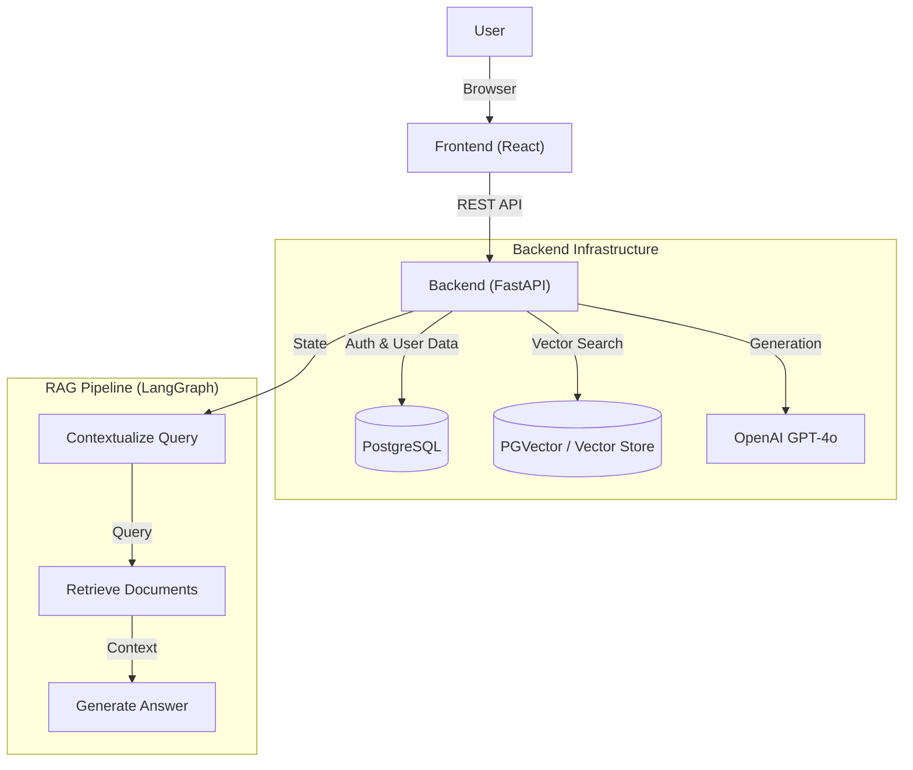

# System Design: DocuMind RAG

## 1. Introduction
DocuMind RAG is an intelligent Question-Answering system that enables users to query their document knowledge base using natural language. The system leverages **Retrieval-Augmented Generation (RAG)** to provide accurate, context-aware answers with citations.

Key features:
- **RAG Pipeline**: Advanced retrieval using semantic search and reranking.
- **Agentic Workflow**: Uses strict state management (LangGraph) to orchestrate retrieval and generation.
- **Role-Based Access Control (RBAC)**: Secure access for Admins, Senior, and Viewer roles.
- **Modern UI**: Responsive React-based frontend.

---

## 2. High-Level Architecture

The system follows a typical client-server architecture, containerized with Docker.



---

## 3. Technology Stack

### Backend
- **Framework**: FastAPI (Python) - High performance, async support.
- **Database**: PostgreSQL (SQLAlchemy ORM) - Relational data (Users, Orgs).
- **RAG Orchestration**: LangGraph & LangChain - State machine for AI logic.
- **LLM**: OpenAI GPT-4o.
- **Authentication**: OAuth2 / JWT (Role-Based Access).

### Frontend
- **Framework**: React 19 + Vite.
- **Styling**: TailwindCSS.
- **State Management**: React Hooks.
- **UI Components**: Lucide React, Framer Motion.
- **HTTP Client**: Axios.

### Infrastructure
- **Containerization**: Docker & Docker Compose.
- **Environment Management**: `.env` configuration.

---

## 4. Backend Design

### 4.1. Database Schema
The relational database manages users and organizations.
*(Inferred based on `models.py` usage)*

- **Organization**: `id`, `name`.
- **User**: `id`, `email`, `role`, `org_id`.
- **UserRoles**:
  - `admin`: Full access.
  - `senior`: Can manage documents.
  - `viewer`: Read-only / Chat access.

### 4.2. API Endpoints
- **`/auth`**: Login/Signup.
- **`/chat`**: Main RAG interaction endpoint.
- **`/documents`**: Upload and manage PDFs.
- **`/admin`**: User management (RBAC protected).

### 4.3. RAG Pipeline (LangGraph)
The core logic resides in `app.rag.chain`. It is modeled as a state machine:

1. **Contextualize Node**:
   - Input: User question + Chat History.
   - Action: Reformulates the question to be standalone.
2. **Retrieve Node**:
   - Input: Reformulated question.
   - Action: Fetches relevant chunks from the vector store using `org_id` as a filter.
3. **Generate Node**:
   - Input: Question + Retrieved Context.
   - Action: Synthesizes an answer using GPT-4o.

**State Definition**:
```python
class AgentState(TypedDict):
    question: str
    chat_history: List[BaseMessage]
    org_id: int
    context: List[LCDocument]
    answer: str
```

---

## 5. Frontend Design

The frontend is a Single Page Application (SPA) providing a seamless chat experience.

### Key Components
- **`ChatInterface.tsx`**: Main chat window. Handles message history and streaming responses.
- **`PDFUploader.tsx`**: Drag-and-drop interface for document ingestion.
- **`AdminPanel.tsx`**: Management view for Admins to handle users and settings.

### User Flow
1. **Login**: User authenticates and receives a JWT.
2. **Select Context**: User enters the chat area.
3. **Query**: User sends a message.
4. **Response**: System displays the thinking process (optional) and final answer.

---

## 6. Deployment & Security

- **Docker**: The entire stack (Frontend, Backend, DB) is defined in `docker-compose.yml` for easy orchestration.
- **Security**:
  - **Passwords**: Hashed (likely using `bcrypt` or similar via `passlib`).
  - **Authorization**: API endpoints protected via `Depends(get_current_user)`.
  - **CORS**: Configured for specific origins.
