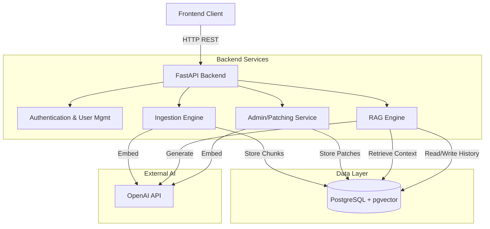
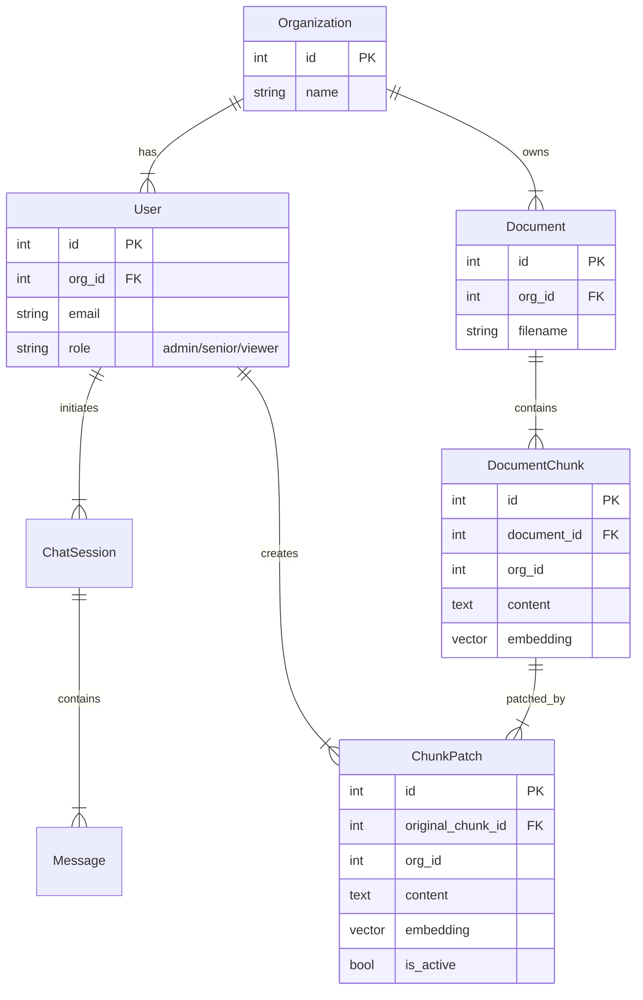
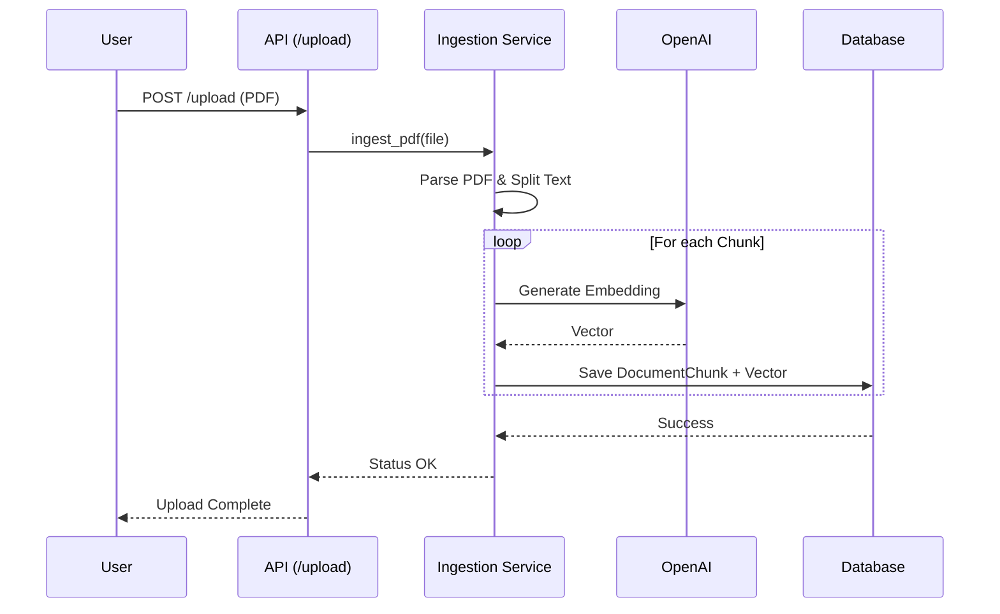
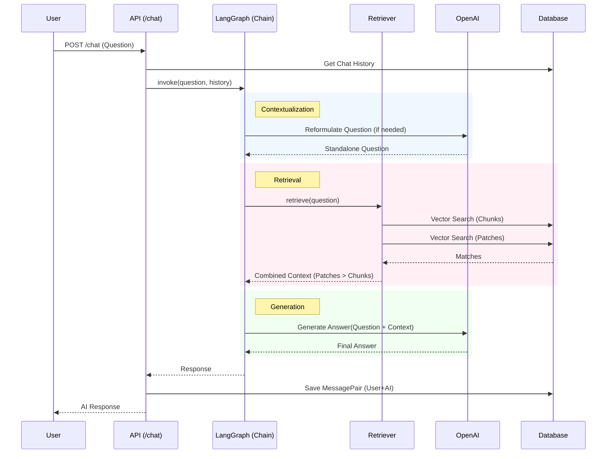
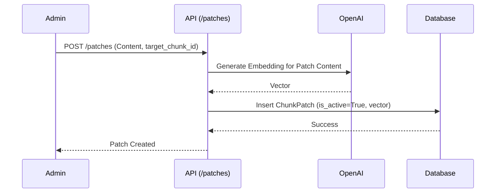

# DocuMind RAG - System Design Document

## 1. Introduction

DocuMind RAG is a Retrieval-Augmented Generation (RAG) system designed to allow users to upload PDF documents and chat with them using AI. It features a unique "Self-Healing" mechanism that allows administrators to patch incorrect chunks of information, ensuring the AI improves over time.

## 2. High-Level Design (HLD)

### 2.1 Architecture Overview

The system follows a typical Client-Server architecture.

*   **Frontend**: A web-based user interface (Landing Page / Dashboard) for uploading documents and chatting.
*   **Backend**: A FastAPI-based REST API that handles business logic, auth, and the RAG pipeline.
*   **Database**:
    *   **Relational DB**: Stores user data, metadata, and chat history.
    *   **Vector DB**: Stores embeddings for document chunks and patches (enabled via `pgvector`).
*   **AI Services**: Uses OpenAI for generating embeddings and LLM responses.

### 2.2 Core Components

1.  **API Gateway (FastAPI)**: Typical entry point, handles CORS, request validation, and routing.
2.  **Ingestion Service**: Handles PDF parsing, text extraction, chunking, and embedding generation.
3.  **RAG Engine (LangGraph)**: Manages the chat flow. It contextualizes user questions, retrieves relevant chunks/patches, and generates answers.
4.  **Self-Healing Service (Patches)**: Allows privileged users to "overwrite" specific document chunks with corrected text ("Patches"), which are prioritized during retrieval.

---

## 3. Low-Level Design (LLD)

### 3.1 Database Schema (ER Diagram)

The database design centers around [Organization](backend/app/db/models.py#21-30) multi-tenancy.

### 3.2 Key Modules & Classes

#### A. RAG Pipeline (`app/rag`)
*   **[ingestion.py](backend/app/rag/ingestion.py)**:
    *   [ingest_pdf](file:///d:/WORK/documind-rag/backend/app/rag/ingestion.py#16-64): Orchestrates the file read -> split -> embed -> save flow.
    *   Tools: `PyPDFLoader`, `RecursiveCharacterTextSplitter`.
*   **[retrieval.py](backend/app/rag/retrieval.py)**:
    *   [custom_retriever](backend/app/rag/retrieval.py#12-32): Finds standard document chunks.
    *   [patch_retriever](backend/app/rag/retrieval.py#34-49): Finds active patches.
    *   [LangGraphRetrieverWrapper](backend/app/rag/retrieval.py#51-86): Merges results, prioritizing patches.
*   **[chain.py](backend/app/rag/chain.py)**:
    *   [AgentState](backend/app/rag/chain.py#14-20): TypedDict for graph state ([question](backend/app/rag/chain.py#26-47), [context](backend/app/rag/chain.py#26-47), `chat_history`).
    *   `workflow`: Defines the LangGraph nodes ([contextualize](backend/app/rag/chain.py#26-47) -> [retrieve](backend/app/rag/retrieval.py#88-90) -> [generate](backend/app/rag/chain.py#57-79)).

---

## 4. Workflows & Sequence Diagrams

### 4.1 Document Ingestion Flow

User uploads a PDF. The backend processes and indexes it.

### 4.2 RAG Chat Flow

User asks a question. The system builds context and answers.

### 4.3 Self-Healing (Patching)

An admin fixes a hallucination by creating a "Patch" for a specific chunk or topic.

## 5. Technology Stack

*   **Language**: Python 3.10+
*   **Framework**: FastAPI
*   **Database**: PostgreSQL (Production) / SQLite (Dev)
*   **ORM**: SQLAlchemy
*   **Vector Search**: pgvector
*   **LLM Orchestration**: LangChain / LangGraph
*   **AI Provider**: OpenAI (GPT-4o, text-embedding-3-small)

## 6. Future Improvements

*   **Asynchronous Ingestion**: Move PDF processing to a background worker (Celery/redis-queue) for large files.
*   **Hybrid Search**: Combine vector search with keyword search (BM25) for better precision.
*   **Evaluation**: Integrate Ragas or properties to evaluate RAG performance automatically.
